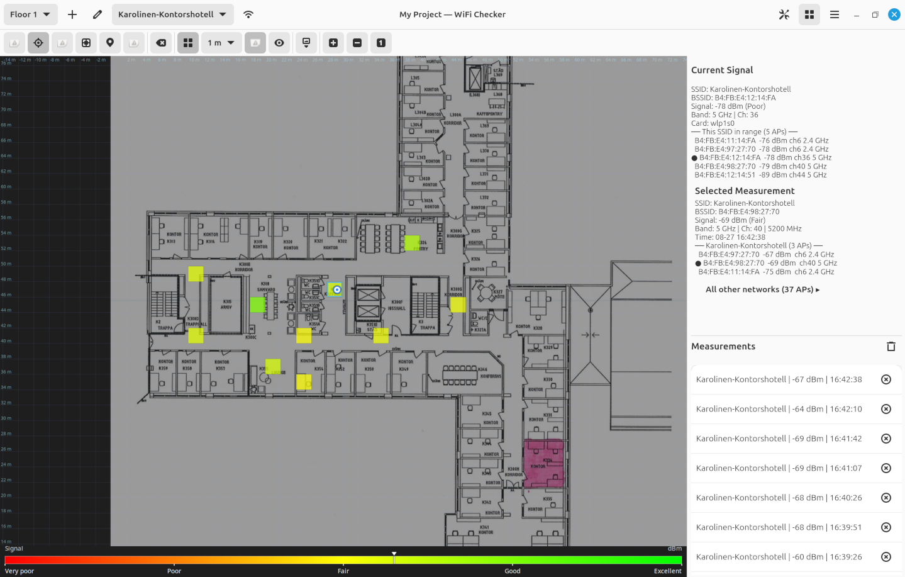

## Fork of danst0/wifichecker

This project is a fork of https://github.com/danst0/wifichecker.
I used Qwen 3.8 27B to implement a few new features and fixed a few bugs so it would be a bit more useful for my particular usecase.
Since these changes are "vide coded" I suggest you avoid using it. 
Here is a summary of the changes made:

- **Project save/load** – multiple floors, per-project drawings, auto-save, project menu (New / Open / Save As).
- **Tools** – select/inspect (two-way map ↔ list ↔ details), ruler distance measure, draw, calibrate (crash fixed), set origin; visibility toggles; custom cursor icon.
- **Measurements** – in-flight indicator (pulsating cell, repeated clicks ignored), multi-WiFi-card selection, no-signal (dead zone) points.
- **Map & colour** – unified coordinate space (no drift on resize, origin persists), absolute colour scale by signal/iperf/Samba with legend ticks and pointer (selected sample or live signal), resizable map/panel split, live Current Signal refresh (~1.5 s).
- **Network consistency** – warns when connected to an SSID not measured on the floor; measuring it asks for confirmation (2 GHz + 5 GHz SSIDs can be mapped together).
- **Scan list per measurement** – every point stores all in-range APs (SSID, BSSID, dBm, channel, band) from a fresh NetworkManager scan over D-Bus (no new Flatpak permissions).
- **Signal source filter** – dropdown picks which AP's signal the map/list/legend show: connected AP, best AP of a measured SSID, or a specific BSSID (only your measured networks); out-of-range BSSIDs render as *no data*.
- **BSSID aliases** – Known APs dialog (grouped by measured SSID, others below) assigns friendly names, stored per project, reflected live in all views.
- **AP visibility** – live "This SSID in range" block in Current Signal, per-point "All other networks" popup (column-aligned table), 2.4/5/6 GHz band display, resizable details/list split in the panel.


<p align="center">
  
</p>

<h1 align="center">WiFi Checker</h1>

<p align="center">
  A GTK4 desktop app for mapping WiFi signal strength across building floors.
  Draw floor plans, take measurements, and visualize coverage as a live heatmap.
</p>

<p align="center">
  
  
</p>

---

## Features

- **Interactive floor plans** — import a background image or draw your own layout freehand
- **Multi-floor support** — manage multiple floors within a single project
- **One-click measurements** — click anywhere on the map to capture WiFi signal data at that point
- **Live heatmap overlay** — signal strength is visualised as a colour-coded grid (red → green)
- **Throughput testing** — optional iperf3/iperf2 and Samba speed tests run alongside each WiFi scan
- **Calibration** — set a real-world scale by clicking two known points and entering the distance in metres
- **Snap-to-grid** — configurable measurement grid with optional snap for consistent coverage
- **Zoom & pan** — scroll-wheel zoom (cursor-centred) plus zoom in/out/reset buttons
- **Project files** – start new projects, open existing ones, or save-as to any location from the project menu
- **Scan list & signal source** – every point stores all APs in range; pick which AP's signal the map shows (connected AP / best AP of a measured SSID / a specific BSSID), browse the full "other networks" list per point, and give APs friendly alias names
- **Auto-save** — project, drawings, and settings persist automatically to `~/.config/wifichecker/`

---

## Screenshots

<p align="center">
  
</p>

---

## Installation

### Build from source

**Prerequisites**

| Dependency | Purpose |
|---|---|
| Rust (stable) | Build toolchain |
| GTK 4.12+ | GUI framework |
| libadwaita 1.4+ | GNOME adaptive UI |
| `nmcli` | WiFi scanning (NetworkManager) |
| `iperf3` or `iperf2` | Throughput testing _(optional)_ |
| `smbclient` | Samba share testing _(optional)_ |

On Fedora/RHEL:
```bash
sudo dnf install gtk4-devel libadwaita-devel NetworkManager
```

On Debian/Ubuntu:
```bash
sudo apt install libgtk-4-dev libadwaita-1-dev libpoppler-glib-dev network-manager
```

**Build & run**

```bash
git clone https://github.com/PatrLind/wifichecker.git
cd wifichecker
cargo build --release
./target/release/wifichecker
```

---

## Usage

### Taking measurements

1. Select or add a floor from the dropdown at the top
2. _(Optional)_ Import a floor plan image via the **Import** button
3. Make sure you are in **Measure** mode (default)
4. Click anywhere on the map — WiFi data is captured immediately and a coloured cell appears
5. Repeat across the area you want to survey

### Calibrating the scale

1. Switch to **Calibrate** mode
2. Click two points on the map that correspond to a known real-world distance
3. Enter the distance in metres when prompted
4. The grid spacing will now reflect accurate metre values

### Drawing a floor plan

1. Switch to **Draw** mode
2. Click and drag to draw orthogonal lines (automatically snapped to the grid)
3. Adjust stroke width with the spinner in the toolbar

### Throughput testing

Open **Settings** (the network icon in the header) and enable:

- **iperf3 speed test** — enter your iperf3 server address, port, and test duration
- **Samba speed test** — enter your SMB server, share name, and credentials

Both tests run in the background alongside every WiFi scan and their results are stored with each measurement.

### Signal source filter & BSSID aliases

A typical network has several APs, but the computer is only connected to one of them. To map the *network's* signal (or one specific AP's signal) instead:

1. The **signal source dropdown** in the header selects which AP's signal the map, list, and legend show:
   - **Connected AP** — the AP the computer is associated with (default, classic behavior)
   - **<SSID>** — one entry per SSID you have measurements for; selects the *strongest* AP broadcasting that SSID (what you usually want for a multi-AP network)
   - **<BSSID>** — an indented entry under each SSID, for one specific BSSID; cells where that AP was not in range stay uncoloured ("no data"), showing exactly where it does not reach

   The dropdown is built from your saved measurements, so it only offers the SSIDs you have actually mapped and the BSSIDs of those SSIDs — not every passing network on the airwaves.
2. Every measurement stores the full scan list taken at that point (up to the 40 strongest APs). Select a point with the **Select** tool to see it in the *Selected Measurement* panel: the measured SSID's APs are shown inline (the associated AP marked with ●), and an **"All other networks (N APs)"** button opens a popup with the complete list of the other APs in range at that point (useful for channel planning).
3. The **Current Signal** section also shows a live **"This SSID in range (N APs)"** block: every BSSID broadcasting your currently connected SSID and its signal, so you can see your own multi-AP network while walking.
4. The band is shown as **2.4 / 5 / 6 GHz** throughout (derived from the center frequency).
5. The **Known APs** button (network icon next to the dropdown) lists every AP seen in the project. Type an alias (e.g. "Office-AP-1") next to a BSSID to give it a friendly name — used in the dropdown and in details. Aliases are saved with the project (including when you close the dialog).

Note: each measurement triggers a fresh scan (up to ~6 s) before recording, so the scan list is current; speed tests still run afterwards, so expect a few extra seconds per point.

---

## Settings

| Setting | Description |
|---|---|
| iperf3 server / port / duration | Configure the throughput test endpoint |
| Samba server / share / credentials | Configure the SMB share test |
| Grid spacing | Visual grid density on the map |
| Measurement cell spacing | Granularity of the heatmap grid |
| Snap to grid | Align measurement points to grid centres |
| Throughput units | Display speeds as Mbit/s or MB/s |

---

## Data storage

The default project and app settings are stored under `~/.config/wifichecker/`:

```
~/.config/wifichecker/
├── project.json        # floors, measurements, calibration
├── settings.json       # app preferences
└── drawings/
    ├── floor_0.png     # drawn floor plan for floor 0
    ├── floor_1.png
    └── ...
```

**Saving a project elsewhere.** The project menu (top right) offers *New Project*,
*Open Project…* and *Save Project As…*. A project saved to a non-default location
keeps its drawing files in a `drawings/` subdirectory next to the project file,
so the two travel together:

```
/path/to/office.json      # project
/path/to/drawings/
├── floor_0.png
└── floor_1.png
```

When a project file is opened, its drawings are copied into that project's own
drawings directory (if they are not already there), so a copied or moved project
file remains self-contained.

---

## Contributing

Contributions are welcome. Please open an issue first for anything beyond a small bug fix, so we can discuss the approach.

```bash
# Run tests
cargo test

# Check formatting
cargo fmt --check

# Lint
cargo clippy
```

---

## License

This project is open source. See [LICENSE](LICENSE) for details.
